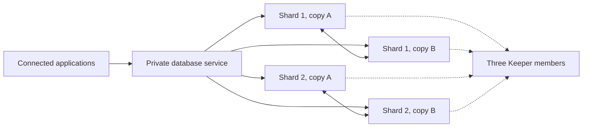

# Managed ClickHouse

Hakopod alpha.52 includes private standalone and clustered ClickHouse.
Use the verified assets from the published release and install its ClickHouse
controller before creating a database. Public endpoints remain unavailable.
The [acceptance record](managed-database-release-acceptance.md) identifies the
native and API recovery tests, their source revisions and their limits.
Development qualification does not establish a production deployment.

ClickHouse stores analytical tables. A standalone deployment runs one data
server. A clustered deployment has one to eight shards, each with two to six
data replicas, and three ClickHouse Keeper members for replication metadata.
The total data-member limit is 48. Keeper is a separate allocation and holds
coordination state, not a second copy of application tables.

The pinned implementation uses ClickHouse 26.3.33.24 and Altinity Operator
0.27.4. Both the operator and the database images are immutable digest references.
The version selected in a database revision is `26.3`.

## Choose a layout

A shard holds part of your data. Replicas hold copies of the same shard. In
the specification, `replicas` counts the additional copies: two shards with
`replicas = 1` create four data members. A cluster also needs three Keeper
members, regardless of the shard count.

This example requests that layout with verified TLS and strict node separation:

```toml
schema_version = 1
name = "events"
engine = "clickhouse"
version = "26.3"
mode = "cluster"
shards = 2
replicas = 1
cpu = "500m"
memory = "2Gi"
storage_gib = 10

[tls]
mode = "required"

[placement]
spread = "nodes"
```

CPU, memory and storage apply to each data member. This example needs at least
four eligible nodes for its placement policy. It reserves 40 GiB for table data,
40 GiB for backup staging and 3 GiB for Keeper. Supporting processes, runtime
overhead and replacement capacity also count toward admission; review the full
allocation before creating it.

For a single data member, use `mode = "standalone"`, `shards = 1` and
`replicas = 0`, and remove the placement separation. Standalone does not run
Keeper. Replacing a failed standalone pod does not provide another live copy
of its data.

Once Hakopod and its controller are installed, save the configuration as
`events.toml` and use the guided dashboard flow or the CLI:

```sh
hakopod database create --project demo --environment development --file events.toml
hakopod database list --project demo --environment development
hakopod database show DATABASE_ID
```

Creation returns an operation. Wait for observed readiness before connecting.
The database's **Connections & security** tab provides its private endpoints
and CA. Use the issued hostname and CA in your client. Internal applications
can use [managed connection bindings](managed-databases.md#application-connections)
to receive the endpoint, credentials and trust material through their service
configuration.

## Data and connection semantics

Applications own tables in the `app` database. Standalone databases use the
Atomic database engine; clustered databases use Replicated, with
ReplicatedMergeTree as the default table engine. DDL is replicated, and table
data is replicated within its shard. A cluster endpoint balances connections;
it does not rewrite SQL, choose a shard key or make an ordinary local table
query read every shard. Cross-shard queries require an appropriate Distributed
table or explicit ClickHouse query design.

The diagram shows the logical layout of the example above, not live cluster
state. Every data member can receive a connection through the private service.
Copies replicate within their shard; Keeper holds coordination metadata.



Native client traffic uses TLS on port 9440; the HTTP interface uses HTTPS on
8443. Interserver transfers use TLS on 9010. Keeper client and Raft traffic use
mutually verified TLS on 9281 and 9444. The management listener on 9000 binds
only to loopback. Application credentials are separate from the bootstrap,
monitoring and recovery accounts. Application users cannot administer server
users, read server files or create other databases.

## Read the topology and monitoring

The requested layout and the running layout are separate facts. A requested
replica is not reported as healthy until its workload, identity, storage,
replication and TLS checks pass. Keeper appears separately from data members
because it stores coordination metadata rather than application tables.

Connected applications in the topology come from managed connection bindings.
Those links show configured access, not live network traffic or the number of
open SQL sessions. The connection counter comes from ClickHouse itself.

ClickHouse connection and query counters sum all data members and include
internal queries and monitoring. Active data-part bytes count one replica per
shard; they do not describe total disk usage or backup staging. Keeper is
excluded from these engine totals. CPU and memory samples describe individual
workloads. A missing or stale sample is unavailable, not a measured zero.
The dashboard does not collect SQL query text or client identities.

## Public endpoints in development

The unreleased ClickHouse public endpoints forward to native TLS on backend
port 9440 or HTTPS on backend port 8443. Public ports come from operator-owned
inventory. Both routes remain disabled until the release candidate passes
native TLS, HTTPS, client-identity migration and revocation checks. See the
[route definitions](../internal/database/public_endpoint.go).

Existing ClickHouse installations first need the reviewed migration to a
separate client certificate leaf. That maintenance can replace data pods and
must converge before a public-endpoint review; later public SAN changes update
the client Secret without changing the Keeper identity template. The current
identity and service checks are in the
[client certificate migration](../internal/cluster/database_clickhouse_client_migration.go)
and [ClickHouse endpoint workflow](../internal/cluster/database_public_endpoint_clickhouse.go).

Cloud public database endpoints remain unavailable. This development contract
does not create a Cloud listener, address, DNS record or firewall rule.

## Sandboxed workers

ClickHouse checks the checksum of its loaded executable. On amd64, gVisor
Systrap syscall patching can change those bytes and make a valid pinned image
fail startup. Hakopod keeps the ClickHouse check enabled. Sandboxed ClickHouse
uses a dedicated `hakopod-clickhouse` RuntimeClass whose runsc profile contains:

```toml
binary_name = "/usr/local/bin/runsc"
[runsc_config]
  platform = "systrap"
  systrap-disable-syscall-patching = "true"
```

The containerd handler is also named `hakopod-clickhouse` and uses
`io.containerd.runsc.v1`. Its options select this profile with
`TypeUrl = "io.containerd.runsc.v1.options"` and the installed `ConfigPath`.
This configuration has a performance cost and applies only to these database
pods. Do not turn on unrestricted runsc flag overrides or change unrelated
workload profiles.

Before allowing admission, the installer must verify the running handler on
each worker. The RuntimeClass must be owned by `hakopod`, carry the annotation
`hakopod.com.node-restriction.kubernetes.io/clickhouse-runtime=systrap-no-patching-v1`,
and select workers bearing that same protected label. It reserves 20m CPU and
50Mi memory of runtime overhead per pod. Hosted allocations require this class.
Self-hosted installations using gVisor opt in through the operator's versioned
configuration:

```toml
schema_version = 1
[server]
clickhouse_sandbox = true
```

The ordinary self-hosted container runtime remains available when this setting
is absent. Self-hosted operators can use the
[reviewed installer runtime plan](../installer/README.md#optional-clickhouse-sandbox)
for an installer-owned single-node host. Preparing that runtime restarts K3s
and needs a maintenance window; installing a controller does not prepare it.

The separate development helper,
`scripts/install-development-clickhouse-runtime.py`, accepts only explicitly
named, lease-owned `k3d-hakopod-clickhouse-worker-N` nodes in `k3d-hakopod-dev`.
It requires idle targets and verifies their resource bounds before restarting
them. It must never be used against a customer or operator cluster.

## Storage, backup and recovery

Each data member reserves its configured data volume and an equally sized
backup staging volume. Keeper reserves 1Gi per member. Memory reservations
include runtime overhead, a replacement member and recovery headroom.

Backups contain one native archive per shard, framed by a strict versioned
manifest and encrypted by the managed-backup service. Capture checks that the
observed topology did not change. Separate shards are captured sequentially;
this is not a transactionally consistent snapshot across all shards.

Restore requires a separate empty database with the same version, mode and
shard count. The entire input is staged and validated before database writes.
Application ingress closes and existing sessions are revoked before restore.
The target keeps its own Keeper namespace so future writes cannot join the
source replication group. Ingress stays closed until recovery is complete and
the user records an inspection. The initial implementation rejects in-place
layout changes; restore into a separately reviewed target instead.

## Earlier development evidence

The results below describe September 29 development work. Current release
qualification is recorded separately in the
[release acceptance record](managed-database-release-acceptance.md).

The named development cluster has passed native standalone and replicated
CRUD, privilege boundaries, client TLS enforcement, wrong-issuer and
wrong-hostname refusal, certificate renewal and ordered deletion. Standalone
native backup and isolated restore have also passed, including binary data,
truncated input, nonempty-target refusal and inspection-gated ingress.

The dedicated sandbox profile and native recovery across two shards with two
replicas each also passed on September 29. Both source and target retained
independent writes, and normal deletion reclaimed the owned resources. Keeper
fault and application binding checks have since passed, including binding
revocation and renewed CA trust. Cross-shard Distributed-table queries passed
after enabling explicit table-engine grants: inserts reached both shards and
every member returned the combined data, while external table engines and
privileged user tables stayed inaccessible.

The final recovery run, `clickhouse-recovery-live-v11.log`, passed against those
grants on September 29 in 860.91 seconds, including cleanup. It restored the
Distributed table and data from both shards, kept source and target writes and
routing independent, rejected truncated archives and nonempty targets, and
left no staged archives. Session revocation and inspection-gated ingress also
passed. Normal deletion removed both databases and their owned volumes.

The two development nodes share one physical VM. These results do not establish
independent-zone or cross-provider availability, or production readiness.
