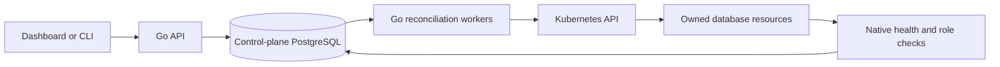

# How Hakopod manages a database

Status: self-hosted alpha.50 includes PostgreSQL, Redis, MySQL and MongoDB. ClickHouse, Oracle Database and Vitess remain held. Neon and Supabase are deferred. Sections about unavailable engines explain source implementations; they do not announce availability. Cloud provisioning requires a separate operator rollout and approved capacity. See the [acceptance record](managed-database-release-acceptance.md) for the exact development tests and their limits.

## Follow one create request

Save a database specification in `orders.toml`:

```toml
schema_version = 1
name = "orders"
engine = "postgresql"
version = "17"
mode = "cluster"
replicas = 1
shards = 1
cpu = "500m"
memory = "1Gi"
storage_gib = 10

[tls]
mode = "required"

[placement]
spread = "nodes"
```

This requests a primary and one replica on different eligible nodes. It needs two data volumes and capacity for operation overhead. Two nodes on one VM do not provide two independent failure domains.

```sh
hakopod database create --project demo --environment development --file orders.toml
hakopod database list --project demo --environment development
hakopod database show DATABASE_ID
```

The dashboard, CLI and API share the same Go handlers. The server validates the strict versioned specification, project/environment permissions, runtime prerequisites and capacity. An accepted request records the database revision, allocation and operation durably in PostgreSQL. A queued operation is not a ready database.



The API and reconciliation workers run in one process by default. Database lifecycle work uses a separate lane from native health probes. The current source starts one lifecycle loop, four observation loops and a bounded maintenance loop. PostgreSQL operation claims use short leases and row locks; expired claims return to the queue. Before runtime writes, the worker rechecks the lease, current revision and authority. It records progress and schedules another bounded step instead of holding an HTTP request open until a cluster starts.

See [API and workers](../internal/api/databases.go), [durable operation claims](../internal/store/managed_databases.go), [allocation accounting](../internal/store/database_allocations.go) and [the specification](../internal/database/model.go).

## Who owns each part

Hakopod owns the resource identity, desired revision, scoped access, credentials, operation history, allocation and application connection grants. An engine-specific Kubernetes controller manages its native database objects. Kubernetes schedules the resulting pods and attaches their owned volumes. The engine's replication protocol determines which members can accept writes.

Ownership checks matter during retries and deletion. A matching name is insufficient: namespace and resource identities must belong to this database. Cleanup must not adopt a pre-existing Secret or delete another workload's volume. A failed or interrupted deletion retains its allocation until the owned persistent data has actually gone.

| Database | Processes and controller | Routing responsibility |
| --- | --- | --- |
| PostgreSQL 17/18 | CloudNativePG, PostgreSQL members, optional PgBouncer | Separate primary and replica services; optional pooled versions of each route. |
| Redis 8 | Credential-safe Opstree Redis operator and Redis members | A cluster-aware client follows slot ownership and redirections. |
| MySQL 8.4 | Oracle MySQL Operator, InnoDB Cluster members with sidecars, MySQL Router | Router has explicit primary and secondary ports. Voting members determine write availability. |
| MongoDB 8.0 | MongoDB Kubernetes Controller, replica-set members and agents | The driver discovers members and selects according to read preference and write concern. |
| ClickHouse 26.3 | Altinity operator, data members, three Keeper members for clusters | Local tables remain local to a shard. Distributed tables or explicit queries combine shards. |
| Oracle Database Free 26ai | Hakopod-owned standalone StatefulSet, TCPS listener and volumes | One PDB service. Free does not implement a Data Guard cluster. |
| Vitess 23, under construction | Namespace-scoped operator, MySQL/vttablet, vtgate, vtctld, vtorc and three etcd members | vtgate uses keyspace, shard map and explicit VSchema. Native acceptance is pending. |

Read the [PostgreSQL/Redis](managed-databases.md), [MySQL](managed-mysql.md), [MongoDB](managed-mongodb.md), [ClickHouse](managed-clickhouse.md) and [Oracle](managed-oracle.md) guides before choosing an engine. Oracle Free is proprietary free-to-use software with upstream limits. Enterprise and Data Guard have a source implementation, but deployment remains disabled pending licensed native acceptance of the hardened controller and customer image.

## Replication, routing and pooling answer different questions

Replication controls copies and quorum. Routing chooses a destination. Pooling reuses a limited number of backend connections. Increasing one does not automatically improve the others.

A PostgreSQL application chooses `read_write`, `read_only`, `pooled_read_write` or `pooled_read_only`. PgBouncer does not inspect arbitrary SQL and move writes to the primary. Transaction pooling releases the server connection at transaction end; session pooling retains it for the session. Applications using session state must choose a compatible mode. Replica reads can lag.

MySQL Router likewise exposes different routes for primary and replica traffic. Redis and MongoDB clients must reach every advertised member needed for discovery and requests. A single reachable seed address does not establish that access. ClickHouse connection balancing does not invent a shard key or query every shard.

Redis Cluster advertises one set of member addresses. The public endpoint source preserves private discovery for applications inside the cluster and allocates a separate TLS listener for each member. An outside client must map each advertised private address to that member's public hostname and port, verify its certificate, and refresh the mapping after a member changes. A `rediss://` seed URI alone does not configure this. Public Redis access remains disabled until outside-in client routing, failover, source filtering and session revocation pass native acceptance.

The proposed Vitess contract uses declared integer hash sharding columns and SINGLE transaction mode. It must not promise cross-shard transactions or live resharding. Its controller, internal TLS, replication identity verification and recovery still need native acceptance. See [Vitess configuration](../internal/database/vitess.go) and [runtime source](../internal/cluster/database_vitess.go).

Every route needs a retry policy. A broken connection after `COMMIT` does not prove the transaction failed. Reconnect with bounded retries, and use application idempotency for writes whose outcome is unknown.

## Capacity includes the supporting processes

The CPU and memory entered in a database form apply to data members. The total reservation also includes sidecars, gateways, coordinators, sandbox overhead and working capacity for replacement and recovery.

For example, three MySQL members at 500m CPU and 1Gi each, three sidecars at 100m/256Mi, and two Routers at 100m/128Mi request 2 CPU cores and 4Gi before replacement and sandbox headroom. Three 10Gi data volumes add 30Gi of requested storage. This is configured capacity, not observed consumption.

ClickHouse reserves a backup staging volume equal to each data member's data volume, plus three 1Gi Keeper volumes in cluster mode. MongoDB includes agent resources and separate log volumes. Oracle Free includes a backup staging volume and its own schema quota; increasing the pod reservation does not remove Oracle's license limits. Vitess includes tablet, gateway, control and topology processes; its source contract accounts for the namespace-scoped operator too.

Cloud serializes database and application reservations against the same workspace allocation. Shrinking members must not refund storage that remains retained. A plan that fits steady-state pods can still fail admission because it cannot fit a replacement. See [CPU reservations](../internal/database/allocation.go), [database model](../internal/database/model.go) and [allocation transactions](../internal/store/database_allocations.go).

## Credentials and TLS have separate jobs

An application binding stores a database reference and endpoint choice:

```toml
[services.api.bindings.DATABASE_URL]
managed_database = "DATABASE_ID"
protocol = "postgres"
endpoint = "read_write"
```

A reviewed connection change checks the application and database revisions, saves the binding and queues application deployment in one transaction. Runtime resolution provides the restricted application account and public trust material to the bound service. Bootstrap, monitoring and recovery accounts stay separate. Applications receive neither Kubernetes credentials nor a database CA private key.

A private address does not authenticate its server. Required TLS checks the issuer, hostname and certificate actually served; native probes also check database access and role. A configuration flag alone cannot verify that a router checks its backend identity. MySQL Router's adversarial backend-certificate test is a separate acceptance gate.

Inspect the CA certificate with `hakopod database trust DATABASE_ID`. Configure the driver to trust that CA and verify the database hostname. MySQL drivers differ in how they interpret URL options, and Oracle clients may need a wallet containing the CA certificate. Never copy the server wallet or turn verification off to make a connection succeed.

Renewal includes issuing/reloading server identities, overlap trust where supported, native verification and application trust rollout. An existing TLS session may outlive a certificate reload. Test new physical connections as well as running applications. Binding removal revokes network access; recovery additionally closes target ingress and revokes sessions before writing restored data.

See [TLS verification](../internal/database/tls.go), [served-certificate checks](../internal/cluster/database_tls.go), [bindings](../internal/store/database_connections.go) and [runtime binding resolution](../internal/cluster/database_bindings.go).

## Recovery starts with the capture semantics

An encrypted archive can be intact and still represent a different consistency boundary from the one an application expects.

| Engine | What capture represents | What it does not establish |
| --- | --- | --- |
| PostgreSQL | A logical custom-format dump of the application database. | Continuous WAL recovery or installation-wide point-in-time recovery. |
| Redis | Captured values and expiries, consistent per shard. | One atomic snapshot across the whole cluster. |
| MySQL | Logical capture while a global read lock holds writes and DDL. | An uninterrupted online backup or continuous binlog recovery. |
| MongoDB | One snapshot read timestamp across supported application collections, with metadata checks. | Continuous oplog recovery. |
| ClickHouse | A native archive for each shard, captured sequentially. | A transactionally consistent snapshot across shards. |
| Oracle Free | APP schema Data Pump capture at a flashback SCN, with a DDL guard. | RMAN, archived-redo recovery or Data Guard. |
| Vitess, under construction | Framed per-shard logical dumps with version, shard map and VSchema. | Global cross-shard snapshot consistency or accepted runtime recovery. |

The managed backup pipeline encrypts archives, records their digest and verifies stored bytes. Restore authenticates the archive before database writes. It requires a separate compatible empty target, closes application ingress, revokes existing target sessions and records recovery progress durably. Failed recovery leaves that target isolated for inspection or deletion; it must not be treated as an empty target for another attempt.

A PostgreSQL example:

```sh
hakopod database restore-plan TARGET_ID --artifact-id ARTIFACT_ID
hakopod database restore TARGET_ID --artifact-id ARTIFACT_ID --review-id REVIEW_ID --name recovered-orders
hakopod database inspect TARGET_ID --job-id JOB_ID --revision REVISION --name recovered-orders --inspected
hakopod database connection-plan TARGET_ID --application-id APP_ID --service api --variable DATABASE_URL --endpoint read_write
hakopod database connect TARGET_ID --review-id CONNECTION_REVIEW_ID --name orders-app
```

Use real IDs and the exact target/application names from your review. Before acknowledging inspection, check representative rows, binary values, indexes, constraints, views and an application read/write path. Inspection and connection replacement are separate actions. Stop or otherwise account for source writes after capture before switching applications; the archive does not include later writes. Keep the source until the cutover is accepted.

See [recovery authorization](../internal/api/database_recovery.go), [recovery store](../internal/store/database_connections.go), [backup runtime](../internal/api/database_backup_runtime.go) and each engine guide for its exact compatible versions and archive limits.

## What placement and monitoring can prove

`spread = "nodes"` requires distinct eligible nodes; `spread = "zones"` requires distinct reported zones. Node and zone labels are scheduler inputs, not evidence of physical independence. Admission checks the eligible domains, but storage, taints, capacity and subsequent failures can still prevent scheduling.

All members belong to one connected Kubernetes cluster. Nodes from different providers need private connectivity, appropriate network encryption, reliable control-plane access and a storage design that tolerates the intended failure. Hakopod does not merge independent Kubernetes clusters into one managed database. Node-local disks cannot be moved by changing a placement label.

The cockpit reads native observations and bounded metrics requests. Revision and observation age determine whether data is current. A configured member count is not a ready count; reserved disk capacity is not disk usage; a replication line is not measured traffic. Keep unavailable measurements unavailable.

Before publishing availability for a new engine, record the exact source, controller/images, architecture, runtime, real-cluster lifecycle, failure, TLS, backup/recovery and application tests. Two nodes on one physical VM can verify scheduler and process behavior. They cannot prove multi-zone or multi-provider resilience.
