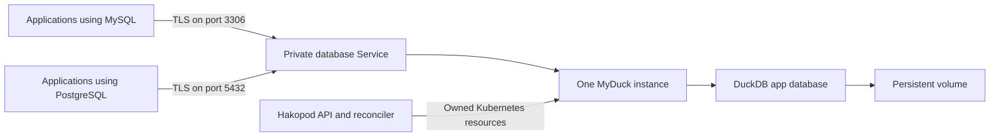

# Managed DuckDB with MyDuck

Status: MyDuck is available in OSS alpha.56 for private, single-instance use on
Linux amd64. Its MySQL and PostgreSQL listeners require TLS. Public endpoints,
replicas, automatic failover, managed connection pooling and in-place resize are
not available. Cloud alpha.35 has separate packaging, deployment and capacity
checks and is not qualified by the OSS release.

MyDuck lets applications use MySQL and PostgreSQL clients with a DuckDB database.
Both connections reach the same data on one persistent instance. A table written
through the MySQL connection can be read through the PostgreSQL connection.

Wire compatibility does not make DuckDB a replacement for every MySQL or
PostgreSQL feature. Test your driver, migrations, data types and queries against
MyDuck before moving an existing application. PostgreSQL extensions, MySQL
replication and the native server administration commands are not provided.

## What runs in your cluster

Hakopod runs one hardened MyDuck container in a Kubernetes StatefulSet. The
container uses one ReadWriteOnce volume for `app.db` and its write-ahead log.
MyDuck translates the two wire protocols and executes queries in DuckDB.



The API and reconciler run in the same Hakopod process. PostgreSQL records
database revisions, operation ownership and backup jobs. Kubernetes runs the
database and stores its volume. Applications receive database connection details
and public certificate authority material. They receive no Kubernetes credentials.

MyDuck has no managed cluster mode, read replica, election or automatic failover.
Kubernetes can replace a failed process and mount its existing volume. That
recovery requires an available node and accessible storage; it is not high
availability. Multiple nodes or zone labels do not replicate this database.

The runtime is built from
[`apecloud/myduckserver` commit `6e3427591fd8895df9585969e7256f958fb639bb`](https://github.com/apecloud/myduckserver/tree/6e3427591fd8895df9585969e7256f958fb639bb)
with the changes in [the managed runtime patch](../patches/myduck/README.md).
The published managed image is
`ghcr.io/hakopod/managed-myduck@sha256:ad324a97360dea53f9e32cb367666b8fefa6f52377000c084a63c1712ca79873`,
version `0.1.0-hakopod.3`. Publication makes the artifact retrievable; it does
not qualify the managed service.

## Configuration

```toml
schema_version = 1
name = "analytics"
engine = "duckdb"
version = "0.3.1-dev.20260919.3"
mode = "standalone"
replicas = 0
shards = 1
cpu = "1"
memory = "1Gi"
storage_gib = 10

[tls]
mode = "required"
```

The first managed image targets amd64 nodes. Each instance needs at least 512Mi
of container memory. DuckDB receives 70% of the configured memory budget, leaving
space for the protocol servers and process overhead. Its temporary-file budget
is one quarter of the configured data-volume size. Temporary files and database
files share that volume, so monitor available storage when queries spill to disk.

The managed runtime limits each wire protocol to 64 connections and applies a
60-second statement deadline. These are runtime limits, not throughput promises.
Choose capacity using your query sizes and concurrency. The Cloud reservation
also includes the existing platform replacement and recovery allowance.

Capacity, placement and engine version are fixed at creation. This first release
does not resize MyDuck in place. Restore to a separate matching target or migrate
your data when a change is needed. Managed connection pooling is not supported.

## Connecting an application

Choose the connection that matches the application's driver:

| Connection | Port | Account | Database | Managed binding protocol |
| --- | --- | --- | --- | --- |
| MySQL | 3306 | `root` | `app` | `mysql` |
| PostgreSQL | 5432 | `postgres` | `app` | `postgres` |

Both accounts use the generated password for that database resource. They are
administrative accounts within an isolated instance. This version does not offer
separate application roles, read-only users or per-application database grants.

Use the hostname and certificate authority from the Connections page or managed
binding. Require certificate and hostname verification in the driver. TLS 1.2 or
newer is required on both ports; plaintext connections are refused. Certificate
renewal replaces the single instance, so applications should reconnect after a
brief interruption.

Dedicated public routes have their own qualification gate. Their implementation
uses a separate reviewed hostname and port for each protocol, source CIDR rules,
connection limits and the database's TLS certificate. They must not be described
as available until public DNS, firewall, certificate rotation and revocation tests
pass. A public connection still uses the same instance and account privileges.

## How the managed runtime is restricted

The container runs as a non-root user with a read-only root filesystem, no Linux
capabilities and no service-account token. It reads its password and TLS key from
owned Secret mounts. SQL cannot change these files or restore other accounts.

The database pod has no outbound network access. Runtime extension installation,
external file and network access, replication configuration and account changes
are disabled. Client `COPY FROM STDIN` and `COPY TO STDOUT` remain the supported
path for transferring data. Queries that depend on reading arbitrary files,
object stores or remote databases need a separate ingestion step.

On startup, MyDuck rebuilds its MySQL account store from the current managed
Secret. A restored database cannot bring back an old password or additional
accounts. PostgreSQL authentication is also rebuilt from that Secret.

## Backup and recovery

A MyDuck backup stops the instance while its files are copied. Existing
connections close and new connections fail until it restarts. The pause depends
on the database size and transfer speed. Schedule backups for a suitable
maintenance window and make sure applications handle reconnection.

Hakopod records a durable operation fence, verifies the current database and
storage identities, and stops the StatefulSet. It waits for the database pod to
disappear before mounting the same volume in an isolated helper. The helper has
no database credentials, network access or listener. It copies only `app.db` and
an existing `app.db.wal`, with a size bound and checksum for each file. The normal
backup pipeline encrypts and uploads that archive.

After the copy, Hakopod removes the helper and waits for its processes to stop
before restarting the database. If the worker disappears, the next worker
performs cleanup without replaying the transfer. The unfinished backup is
reported as failed or cancelled. A successful backup includes a verified archive;
a stopped worker does not create a successful backup receipt.

Restore requires a separate empty database of the same MyDuck version. Hakopod
verifies the entire encrypted archive before changing the target. After the
target process stops, the isolated helper opens its catalog read-only and checks
for existing user objects. This prevents a connected writer from adding data
between the check and replacement. The helper then checks every archive file
and stages the replacement. A durable marker prevents MyDuck from opening files
left by an interrupted replacement.

A failed archive replacement stays stopped and isolated; the source database is
unchanged. After replacement, Hakopod polls live readiness, TLS, and the fresh
replacement pod UID before it can report success. If those checks fail, the
recovery remains unverified and is never reported as successful. The topology
fingerprint comes from the observed pod UID. Inspect a successful restore before
switching application bindings.

These backups exclude credentials, server configuration, temporary files and
point-in-time recovery. Preserve the backup encryption key separately from the
cluster. Losing that key makes the archive unreadable.

## Monitoring and support boundaries

The detail page shows the observed instance, connected applications, ports,
placement, health, certificate state and available Kubernetes CPU and memory
samples. DuckDB storage statistics report allocated persistent blocks. Missing
samples are shown as unavailable; the UI does not invent replication, query or
connection counters.

The alpha.56 native lifecycle, recovery and HTTP cases passed against exact
source `b253812df8236905ab4db2015380dae5da2ed7f1` in the named
`k3d-hakopod-dev` development cluster. They covered both private protocols,
authentication and TLS refusal, restricted SQL, persistence and replacement,
credential and certificate changes, binding and revocation, encrypted backup,
separate-target restore, interruption recovery, durable operation fencing,
deletion and fixture cleanup. Source and cluster baselines were unchanged, and
helper processes were gone after cleanup.

See [managed database release acceptance](managed-database-release-acceptance.md)
for the measured evidence and its limits. Public routes require separate
outside-in acceptance and remain unavailable.

## SQL query statement forms

Managed query execution accepts one statement with optional trailing semicolon and comments. Standard single-quoted strings and double-quoted identifiers use doubled quotes. Line comments and nested block comments are accepted. The query guard rejects multiple statements, unterminated quotes or comments, escape and byte string prefixes, dollar-quoted strings, backtick identifiers, backslashes in quoted text, and non-ASCII unquoted tokens. MyDuck routes some PostgreSQL syntax through a different parser, so ambiguous forms are rejected before runtime access.

Use `$1`, `$2` and bound parameters for values containing delimiters, quotes, backslashes or Unicode. Those values are sent separately and are not scanned as SQL. Query capabilities remain disabled until native qualification passes; compilation alone does not enable support.
