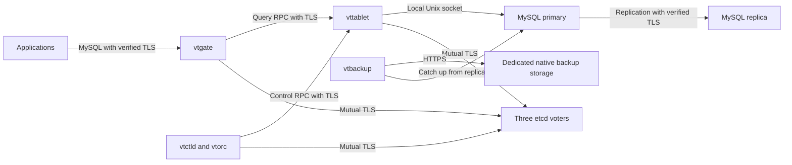

# Managed Vitess

Status: release candidate under native qualification, October 5, 2026. The
dashboard, API and runtime source implement creation, routing and recovery, but
release availability remains gated until the pinned images pass the recorded
native lifecycle, security and recovery checks. This page does not announce a
released or production-verified service.

Vitess runs MySQL behind a routing layer. Use it when a database needs explicit
shards and your application can choose a stable sharding key. An ordinary MySQL
database with replicas has fewer moving parts. The managed Vitess contract runs
these components in your Kubernetes cluster.

## What runs

| Component | Purpose | Desired count |
| --- | --- | --- |
| MySQL | Stores each shard's data and replicates it | One primary and the configured replicas per shard |
| vttablet | Manages the MySQL process and serves requests from vtgate | One per MySQL member |
| vtgate | Authenticates clients and routes queries using the VSchema | One standalone; two clustered |
| vtctld | Provides the internal control API | One |
| vtorc | Observes tablet replication and coordinates primary changes | One per shard |
| etcd | Stores the native topology records | Three voters |
| Namespace operator | Reconciles this database's Kubernetes resources | One |
| Backup storage controller | Observes this database's native backup location | One |
| vtbackup | Creates a physical copy used to seed database members | Temporary jobs, one schedule per shard |



The API, authorization and durable operations stay in Hakopod's Go management
process, backed by PostgreSQL. The namespace operator has Kubernetes access only
inside this database's namespace. Applications receive the database account and
public trust material. They do not receive Kubernetes credentials, the issuer
key, replication credentials or backup storage credentials.

The source currently selects Vitess 23.0.6, MySQL 8.4.6, Vitess Operator 2.16.0
and etcd 3.5.17. The patched Vitess and operator images have been built for
development acceptance; their upstream images alone do not satisfy this
contract. Candidate publication remains blocked until native acceptance and
release verification pass. The pinned runtime
targets amd64. ARM64 has not been qualified.

## Layout and routing

Standalone means one shard and no replicas. It still requires the control
components above and a native backup destination. It cannot survive loss of its
only MySQL member without recovery. Cluster mode accepts one, two, four or eight
shards and one to five replicas per shard, with at most 48 MySQL members.

The `replicas` value applies to every shard. Two shards with two replicas means
six MySQL members. Shards hold different rows; replicas hold copies of their
shard. Adding replicas does not increase the amount of distinct data a database
can hold.

The VSchema tells vtgate where rows belong. The initial contract uses one integer
hash sharding column per declared table. Declare every application table that
needs this routing. A query that includes that key can target its shard;
queries without it may visit several shards. Choose the key around access
patterns and transaction boundaries, rather than choosing a shard count first.

This configuration is an example for the implementation under validation. The
backup destination ID must come from an existing, operator-approved destination;
the placeholder below is not a usable ID.

```toml
schema_version = 1
name = "orders-vitess"
engine = "vitess"
version = "23"
mode = "cluster"
shards = 2
replicas = 2
cpu = "500m"
memory = "1Gi"
storage_gib = 10

[tls]
mode = "required"

[placement]
spread = "nodes"

[vitess]
backup_destination_id = "OPERATOR_APPROVED_DESTINATION_ID"
backup_destination_revision = 1

[[vitess.tables]]
name = "orders"
sharding_column = "customer_id"

[[vitess.tables]]
name = "order_items"
sharding_column = "customer_id"
```

Create the same specification through the shared API with the CLI:

```sh
hakopod database create --project orders --environment production --file orders-vitess.toml
```

The dashboard collects the same fields. It lists destinations from the selected
project and environment and records the selected immutable revision. The server
still requires an operator approval matching that destination revision, project,
environment and database name.

This example needs six eligible nodes for its strict member placement. Zone
placement uses reported Kubernetes zones instead. Separate topology voters and
gateways are spread within the same eligible allocation. Node labels prove a
scheduling rule, not independence of providers, storage, networks or power.
Cross-provider availability requires a connected private network and measured
failure tests. Separate Kubernetes clusters are outside this deployment model.

Routing and capacity are fixed at creation in the initial contract. Online
resharding, cross-shard transactions, distributed foreign-key guarantees and
arbitrary custom vindexes are outside it. `SINGLE` transaction mode keeps a
transaction within one shard. Restore into a separate reviewed layout for a
supported migration; do not change a sharding key on a live database by editing
its TOML.

## Connect

vtgate exposes the MySQL protocol on port 3306. The database target selects the
tablet role: use `app@primary` for writes and primary reads, or `app@replica` for
replica reads. These are explicit routes. They do not promise automatic SQL
read/write splitting or read-after-write consistency on a replica.

```sh
mysql --host=OBSERVED_HOST --port=3306 --user=app --password \
  --database='app@primary' --ssl-mode=VERIFY_IDENTITY \
  --ssl-ca=database-ca.crt
```

Use the hostname and public CA supplied by the database's Connections view.
For a driver, configure issuer and hostname verification explicitly; a generic
MySQL URL does not configure every library's TLS settings. Existing sessions
may fail when a gateway or primary changes. Retry a transaction only when the
application can determine that doing so is safe.

The application identity owns the `app` schema. Internal administration uses a
separate local Unix-socket account; the replication user is separate and requires
TLS. A table ACL limits query RPC access to the application identity. The private
network policy admits applications only to vtgate, not to tablets, etcd or the
control API. Dedicated public endpoints are not available in this contract.

## Security and observation

Each database has its own issuer. The desired policy requires TLS for clients,
query/control RPCs, replication and etcd traffic. Replication uses owned DNS
Services so the client can verify the primary's hostname. etcd also requires
client certificates. Private keys stay in namespace-owned Secrets.

The upstream replication patch preserves `verify_identity` when Vitess generates
MySQL replication commands, including the catch-up path used by backups. The
operator patch forwards the TLS mounts and accepted flags to native backup jobs.
It also gives gateway and control pods the group access needed for Hakopod's
additional TLS mount. That mount is read-only and uses group-only file
permissions. Vitess processes run as an unprivileged user.
The semi-sync monitor uses the local internal account for its `_vt` heartbeat
table. Application account grants stay limited to application tables.
Those patches are visible in
[the source patch script](../scripts/apply-managed-vitess-patches.py).

Gateway accounts can manage application tables. They cannot create MySQL users
or read MySQL credential tables. The pinned gateway may return success for
`SET GLOBAL` after checking and ignoring it; this does not change the underlying
MySQL setting. Native acceptance checks the tablet setting before and after the
request and checks that the direct application account refuses global changes.

The observation code checks native MySQL roles, unique server identities,
replication transport settings, the reviewed VSchema, owned pod identities and
allocated resources. Gateway checks authenticate through TLS, compare the served
certificate with the issued certificate and require plaintext refusal. Certificate
rotation and failover still require native acceptance before these fields can be
presented as a supported guarantee.

Requested resources and measured resource samples are separate facts. A desired
replica count is not evidence that replicas are healthy. Missing native metrics
stay unavailable. The current Vitess work does not provide accepted query latency,
replication lag, cache-hit or storage-usage telemetry.

## Two kinds of backup

Native physical backups let a new tablet recover data before joining replication.
They matter when a member has been offline longer than the source retains its
binary logs. An empty initial backup bootstraps the shard; subsequent jobs restore
a copy, catch up and write a new copy to the dedicated destination.

The operator must explicitly approve credentials dedicated to this database and
the destination's network addresses. A path prefix is not an IAM permission
boundary. Workloads receive only the storage access key, secret and optional
session token. They never receive Hakopod's logical-archive decryption identity.
The destination must use HTTPS. Configure the storage provider's encryption and
access policy as part of that approval; transport encryption is not encryption
at rest.

The native destination is reserved for one database. Use a separate destination
for downloadable archives. Hakopod refuses native storage that already has
archive jobs, imports, schedules or retained archives. It also refuses to rotate
or delete that destination while the database still owns resources.

The installation administrator supplies a strict TOML approval file. It names
the destination revision, project, environment, database and exact public
storage addresses. It contains no access keys. The administrator must first
check the key's actual storage permissions; ticking a field cannot change IAM.

```toml
schema_version = 1

[[approvals]]
destination_id = "REPLACE_WITH_THE_SAVED_DESTINATION_ID"
revision = 1
project = "orders"
environment = "production"
database = "orders-vitess"
dedicated_credentials = true
endpoint_cidrs = ["REPLACE_WITH_STORAGE_IPV4/32"]
```

Set `backups.vitess_approvals_file` in the operator's versioned server TOML, or
`HAKOPOD_VITESS_BACKUP_APPROVALS_FILE` for the Cloud embedding, to that file's
path. The file must be regular, no larger than 64 KiB and not writable by group
or other users. Changing endpoint addresses requires operator review and a
runtime restart. An address change is allowed to interrupt backups rather than
silently expanding network access. The runtime remains disabled until the
acceptance checks at the end of this page pass.

Native storage approval is checked separately from certificate renewal. A
removed approval pauses new backup work, removes its Secret and allowed storage
addresses, and stops owned backup jobs and storage-controller processes. Cleanup
also runs for failed database creation and retries until those processes are
gone. Reducing the approved address list follows the same cleanup path before
backups resume with the smaller list. Database tablets and data volumes stay in
place.

The native operator also gives each vttablet the storage credentials so it can
restore a member from a backup. Revocation keeps those database processes
running to preserve service. They may still hold a copy of the key. Deleting a
Kubernetes Secret does not invalidate that key at the provider, and a
network-policy change may leave an established connection open. To make the key
unusable, revoke it with the storage provider too. Hakopod does not claim that
all credential holders have stopped. The current contract does not rotate live
native-storage credentials.

The source schedule runs hourly, forbids overlapping jobs for the same shard,
sets a one-hour deadline and removes completed Job objects and temporary claims.
The patched controller counts backup pods and claims that are still waiting for
deletion before starting another job. It allows at most two of each per shard,
including the initial backup. A retry reuses its own unchanged claim. If the
controller stopped between creating a claim and creating its Job, it reclaims
that abandoned claim after two hours, once no backup pod is using it.
It asks native pruning to retain copies for at least 72 hours and never remove
the last two complete copies. These are minimum retention rules, not an absolute
storage cap. Failed uploads and storage-side retention policies need operational
monitoring. Do not equate a listed backup object with a tested member reseed.

Hakopod's downloadable logical archive serves a different purpose: recovering
application data into a separate empty database. It records exact versions,
the shard map, VSchema and checksums. Each shard is captured while holding a
read lock; writes to that shard wait. The archive does not represent one global
instant across all shards and is not continuous point-in-time recovery.

The recovery code stages every shard and verifies the whole authenticated input
before running SQL. It closes application ingress, disconnects existing gateway
sessions, verifies that the target is empty, and imports with application-schema
privileges. The target must have the same supported version, shard map and
routing schema. Application access remains closed until recovery and inspection
are recorded. The source database is retained.

## Resource and lifecycle costs

Each MySQL member requires at least 500m CPU and 1Gi memory, plus 100m CPU and
256Mi for vttablet. Each gateway adds 250m CPU and 256Mi. vtctld and each vtorc
add 500m CPU and 256Mi. Their Go runtime uses one processor and a 192MiB
memory target within that allocation. Each etcd voter adds 100m CPU, 256Mi and a 1Gi volume.
The namespace operator adds 100m CPU and 256Mi; its backup storage controller
adds 100m CPU and 128Mi.

A backup container runs both vtbackup and MySQL. It reserves the configured
MySQL resources plus 100m CPU and 512Mi for vtbackup, with a 448MiB Go memory
target. Backup and restore handle one file at a time. S3 uses one upload worker,
and closing a file waits for the upload result before releasing that file's
worker. This limits multipart buffers to two parts; the supported 1TiB maximum
can require about 210MiB of buffers. Tablets use a separate 192MiB Go target.

Admission also needs replacement and backup headroom. Initial and scheduled
backup cleanup can overlap, so the current conservative contract reserves two
backup jobs, including vtbackup overhead, and two data-sized scratch claims per shard. These are
capacity reservations, not a promise that every resource is always running.

Deletion pauses the namespace operator after the database deletion request is
accepted. This prevents it from recreating children while Kubernetes removes
the owned resource hierarchy. The namespace follows, and capacity stays reserved until
Kubernetes confirms volume reclamation. Deletion of external backup objects
follows the destination's retention policy; namespace deletion does not erase
an object-storage bucket.

If approval removal already paused the operator, deletion keeps it paused.
Removed backup credentials and network access stay closed. Kubernetes handles
the remaining garbage-collection and volume-protection finalizers.

## Acceptance and source references

Source compilation, focused tests, a generated manifest or a dashboard preview
cannot establish production readiness. Before enabling this engine, the release
needs native standalone and sharded create/connect/delete, TLS refusal and
renewal, least-privilege checks, primary loss, member replacement after binary-log
purge, routing correctness, backup/recovery integrity, inspection gates and
complete owned-resource cleanup. Multi-zone or multi-provider claims require
additional physically independent failure tests and measured recovery objectives.

The source build helper,
[build-managed-vitess.sh](../scripts/build-managed-vitess.sh), targets the
approved Linux VM. It prepares binaries and image contexts; it does not install
controllers, publish images or enable the runtime. Release images must be pinned
to the tested registry digests.

The build records hashes for every replacement binary and saves the complete
patches against the two official source commits. Native acceptance records its
exact source and test files alongside the image digests. The release verifier
checks those records, pulls the same images anonymously, and compares the
binaries inside them with the recorded hashes. It does not rebuild an image
after testing it. Missing, skipped, failed or incomplete native test events
cannot qualify a release. These checks remain part of the work under validation
until real acceptance evidence and published digests are recorded.

Image packaging on the development VM must use a builder whose storage is under
the approved scratch directory. Its OCI archives preserve the manifests used
for testing and publication. Do not load a large database image into the VM's
default Docker store without first checking where that store lives and how much
space it has.

- [Vitess 23.0.6 source](https://github.com/vitessio/vitess/tree/0f1ed062dec171e0adfab796110549752901e299)
- [Vitess Operator 2.16.0 source](https://github.com/planetscale/vitess-operator/tree/10a3b742c02c38f97d554739d5a257197daa48f9)
- [Vitess concepts](https://vitess.io/docs/23.0/concepts/)
- [Managed database architecture](managed-database-architecture.md)
